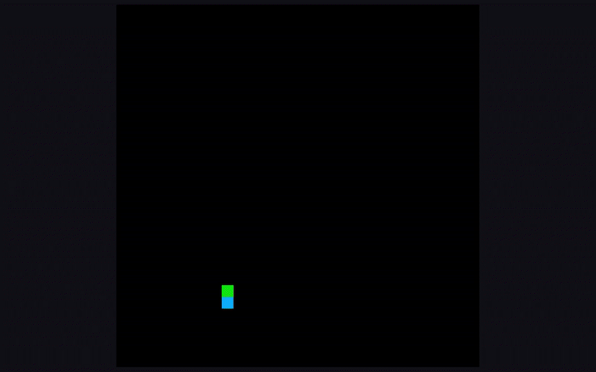

  

# Snake X

Snake X is a pyxel based arcade snake game. X stands for the functionality to move in "X" directions.

# Controls

| Control         | Key                            |
|-----------------|--------------------------------|
| Move up         | `UP arrow key` or `W`          |
| Move down       | `DOWN arrow key` or `S` or `X` |
| Move left       | `LEFT arrow key` or `A`        |
| Move right      | `RIGHT arrow key` or `D`       |
| Move up right   | `E`                            |
| Move up left    | `Q`                            |
| Move down right | `C`                            |
| Move down left  | `Z`                            |
| Restart         | `G`                            |
| Quit            | `ESC`                          |
